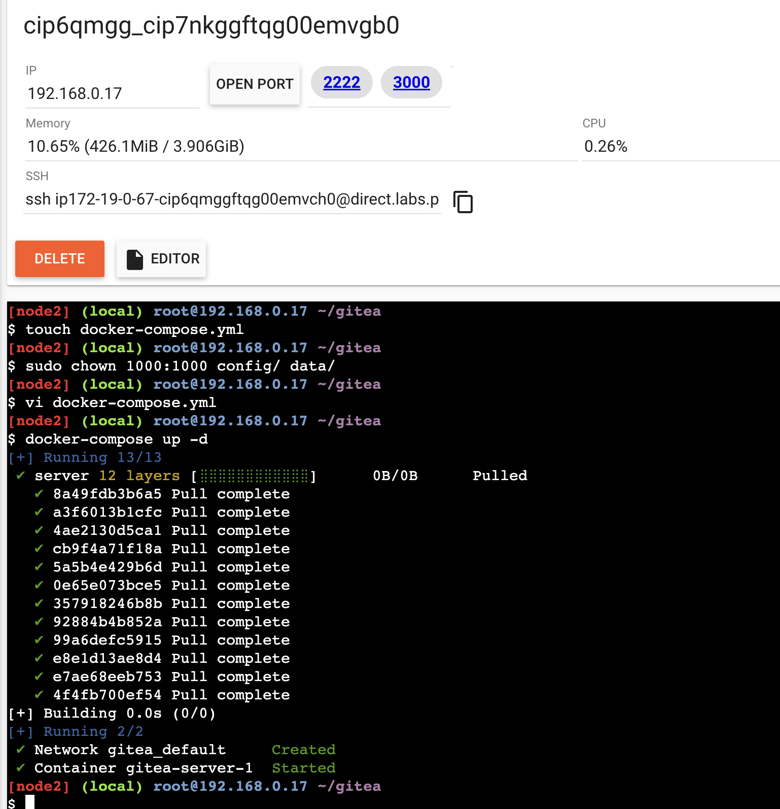
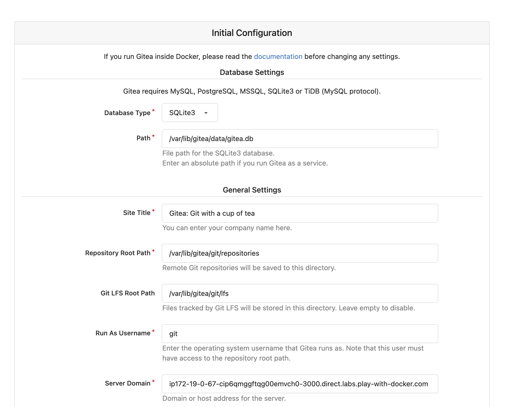

# gitea-workshop

Starting with Gitea 1.19,  Gitea Actions are available as a built-in CI/CD solution.

## 事前準備

1. 註冊 [Docker Hub][1] 帳號
2. 登入 [Play With Docker][2] 平台

[1]:https://hub.docker.com/
[2]:https://labs.play-with-docker.com/

## 安裝 Gitea 服務

多種安裝方式可以參考[線上文件][3]，我們選擇使用 [Installation with Docker (rootless)][4] 方式安裝。

```bash
mkdir -p gitea/{data,config}
cd gitea
touch docker-compose.yml
sudo chown 1000:1000 config/ data/
```

打開 `docker-compose.yml` 檔案，輸入以下內容：

```yaml
version: "2"

services:
  server:
    image: gitea/gitea:latest-rootless
    restart: always
    volumes:
      - ./data:/var/lib/gitea
      - ./config:/etc/gitea
      - /etc/timezone:/etc/timezone:ro
      - /etc/localtime:/etc/localtime:ro
    ports:
      - "3000:3000"
      - "2222:2222"
```

[3]:https://docs.gitea.com/next/category/installation
[4]:https://docs.gitea.com/next/installation/install-with-docker-rootless

## 啟動 Gitea 服務

```bash
docker-compose up -d
```



請點選 3000 port 的連結就可以看到首頁了，請參考底下畫面



設定 Administrator 帳號，請參考底下畫面


按下送出後，請等待 Install 過程


